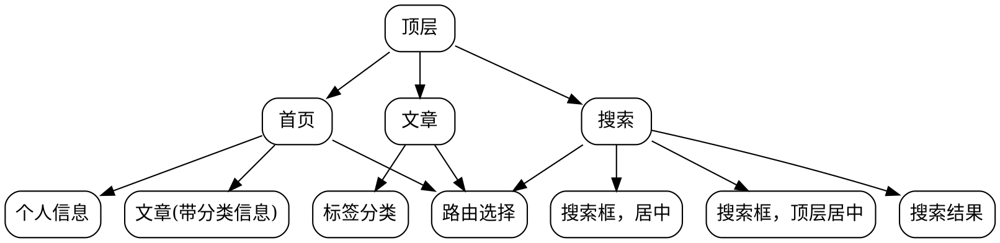

# 个人博客

## 框架

## 编译时静态统计文章信息放入json文件。

json:
    {
        "article": number,      # 文章数量
        "tag": number,          # 标签数量
        "path": {
            tag: [path, path, ...] # 带标签的路径
        }
    }
